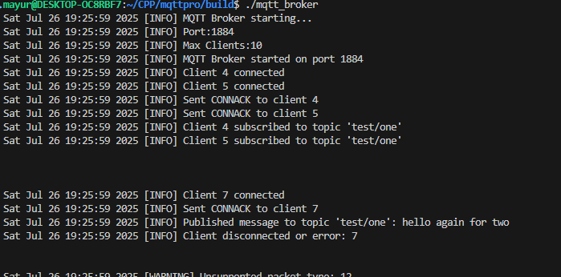
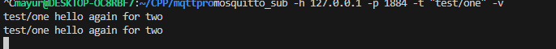
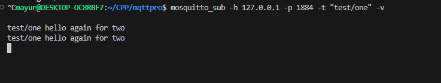

# Lightweight Custom MQTT Broker in C++

This project is a simple yet effective MQTT Broker implemented in C++. It supports essential MQTT features such as:

- Client connection handling using TCP sockets
- Topic-based subscriptions
- Multithreaded client handling
- Basic MQTT v3 message parsing (PUBLISH, SUBSCRIBE, etc.)
- Logs with custom log levels

## 🧠 Why I Built This

I wanted to deeply understand how MQTT protocol works under the hood. Instead of just using existing brokers, I created my own MQTT server from scratch to get hands-on with:

- Low-level socket programming
- MQTT packet structure
- Multithreaded design
- Subscription management

## 🔧 Features

| Feature               | Status |
|-----------------------|--------|
| TCP Client Handling   | ✅     |
| SUBSCRIBE Support     | ✅     |
| PUBLISH Message Flow  | ✅     |
| Threaded Connections  | ✅     |
| Graceful Disconnection| ✅     |


##  Upcoming Features
- Wildcard topic matching (`+` and `#`)
- observer patern implementation


##  Tested With

- `mosquitto_pub` and `mosquitto_sub` CLI tools
- Custom client connections over `localhost`


used mqtt protocal :
https://github.com/eclipse-mosquitto/mosquitto/blob/ff1187fd9c74ae3a7ba0097e7933828bdcdbce71/include/mqtt_protocol.h


example usage:
Test using :mosqito sub and pub 

mosquitto_pub -h 127.0.0.1 -p 1884 -t "test" -m "hello again"

// -v to keep alive connection 
mosquitto_sub -h 127.0.0.1 -p 1884 -t "test" -v 








## 🚀 How to Build

```bash
git clone https://github.com/mayurjadhav/mqtt-broker-cpp.git
cd mqtt-broker-cpp
mkdir build && cd build
cmake ..
make
./mqtt_broker

